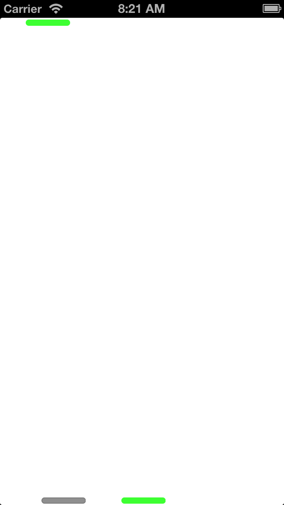
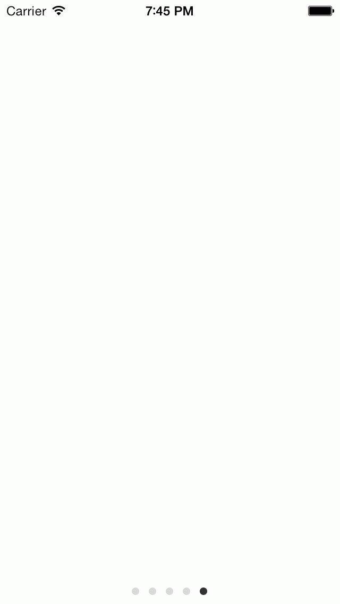

An iOS customizable ScrollIndicator

[](http://twitter.com/leverdeterre)
[](http://github.com/leverdeterre/CustomScrollIndicator/LICENSE)
[](https://github.com/CustomScrollIndicator)


- allows to customize UIScrollView scroll indicators, 
- Only one category





### Enum to configure indicator positions

```objective-c
typedef enum {
  JMOVerticalScrollIndicatorPositionRight     = 1 << 0, //Default for vertical
  JMOVerticalScrollIndicatorPositionLeft      = 1 << 1,
  JMOHorizontalScrollIndicatorPositionBottom  = 1 << 2, //Default for horizontal
  JMOHorizontalScrollIndicatorPositionTop     = 1 << 3,
} JMOScrollIndicatorPosition;

```


### Enum to configure indicator type

```objective-c
typedef enum {
    JMOScrollIndicatorTypeClassic = 0, //Default
    JMOScrollIndicatorTypePageControl
} JMOScrollIndicatorType;

```

### Usage ... very simple, just enable the customization (with default parameters)
```objective-c
[scrollView enableCustomHorizontalScroll];
```

###  With options 
```objective-c
 [scrollView4 enableCustomScrollIndicatorsWithScrollIndicatorType:JMOScrollIndicatorTypeClassic 
              positions:JMOHorizontalScrollIndicatorPositionTop 
              color:[UIColor orangeColor]];
    
```

###  Refresh ... call methods in your scrollViewDelegate (scrollViewDidScroll is optionnal, KVO did the job)

```objective-c
- (void)scrollViewDidScroll:(UIScrollView *)scrollView
{
    [scrollView refreshCustomScrollIndicatorsWithAlpha];
}

- (void)scrollViewDidEndDecelerating:(UIScrollView *)scrollView
{
    [UIView animateWithDuration:0.25 animations:^{
        [scrollView refreshCustomScrollIndicatorsWithAlpha:0.0];
    }];
}
    
```


